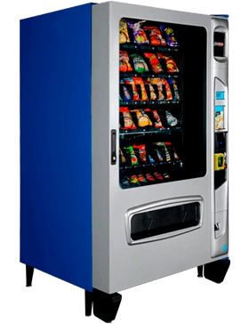

## Vending Machine

  

## Project Overview
In this project we use a Basys 3 to simulate a vending machine, in which you can enter coins of 1, 2, 5 and 10 pesos, you can select between 5 products and it shows the price in two seven segment displays and the money entered and the change on another two seven segment display. The change in shown after pressing a confirmation button.

In this machine it is not possible to enter more than 99 pesos and if the money inserted is less than the price of the product, it does not accept the purchase.

# Content List

1. [Vending Machine](#vending-machine)
2. [Project Overview](#project-overview)
3. [Requirements](#requirements)
4. [Initial Setup](#initial-setup)
5. [Installation](#installation)
6. [Basys 3](#basys-3)
7. [Code](#code)
8. [Save to Memory](#save-to-memory)
9. [Vivado](#vivado)
10. [Simulation](#simulation)
11. [Add New Things](#add-new-things)
12. [Important Links](#important-links)
13. [Contact](#contact)

# Requirements
To run this project you need the following components:
-Vivado
-Basys 3

# Inital Setup

## Installation
For this project, the use of vivado was essential, which can be found on the AMD website: https://amd.com/es/products/software/adaptive-socs-and-fpgas/vivado.html It should be noted that a user license is required for its use, the version we used to create this machine was version 2022.1.

# BASYS-3
The Basys 3 is a circuit board that allows you to run code in a compact and physical way, it includes 16 levers, 16 LED indicators, 4 7-segment displays, 5 buttons and a quartz clock, which makes it very useful for a variety of uses.

We test our code using the EDA Playground website. On this page we can test the code by programming a testbench that indicates the program inputs. It is important to take into account that the clock can be implemented both in the testbench or in the VHDL code but for the proper functioning of the Basys 3 we must program it in the VHDL code.

Once the simulation on the web page acts the way we expect it to work and we test combinations that should not be possible so that we can avoid errors in the software, we can export the code to Vivado, where we can transfer it to Basys 3

# Codes
## Product Selector

## Coin Counter

## Change Calculator

## Multiplexor

## Vending Machine Top

# Save to Memory

# Vivado

# Simulation

## Requirements
(Tu contenido aquí)

...

