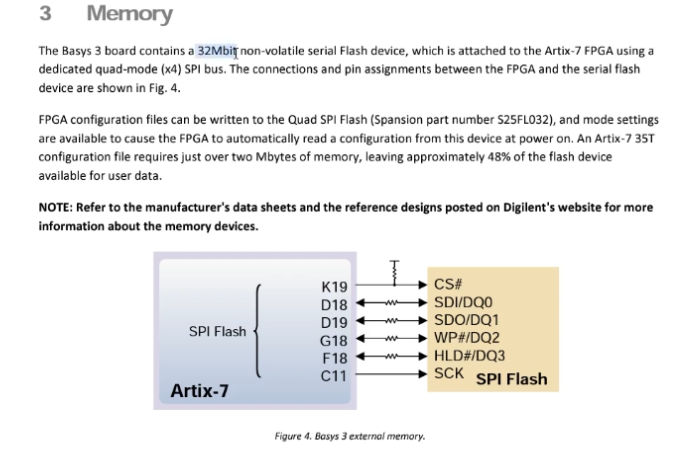
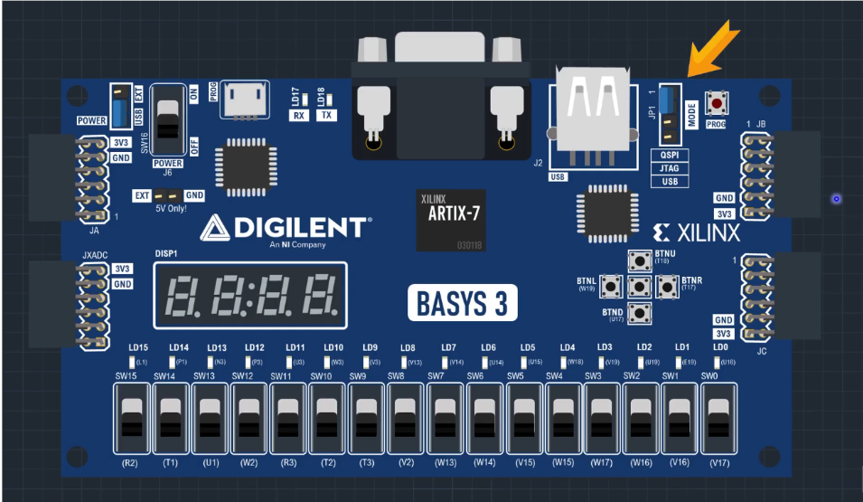
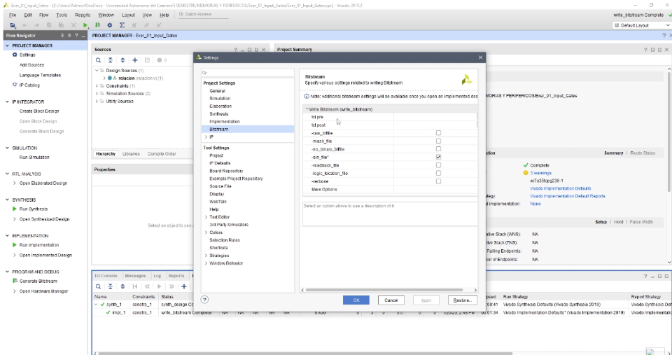
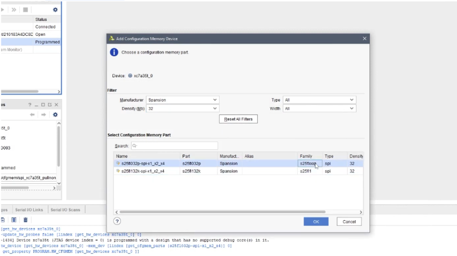
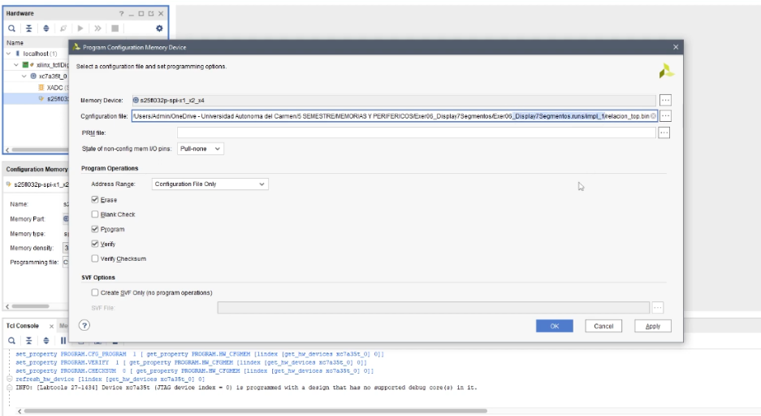
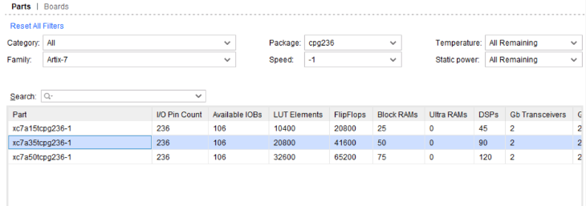
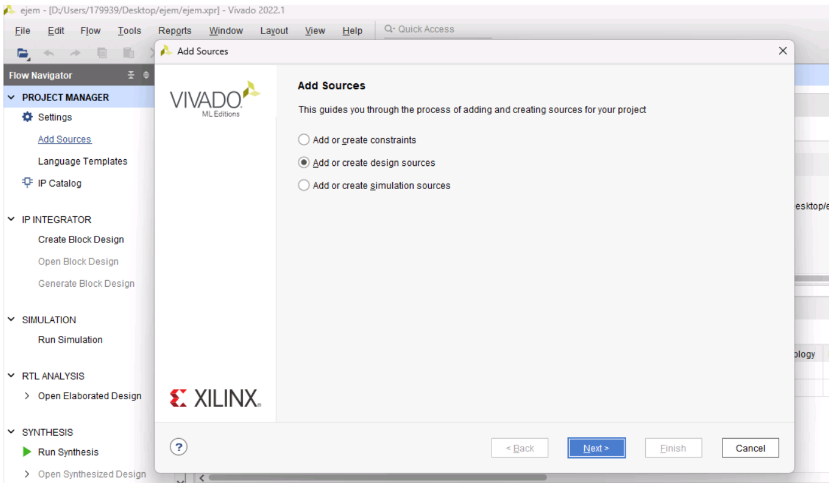
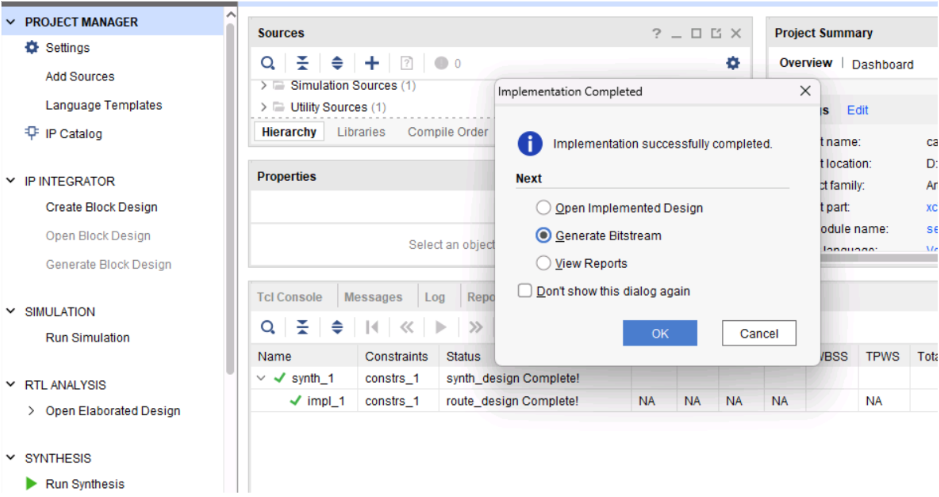

## Vending Machine

  

  

## Project Overview
In this project we use a Basys 3 to simulate a vending machine, in which you can enter coins of 1, 2, 5 and 10 pesos, you can select between 5 products and it shows the price in two seven segment displays and the money entered and the change on another two seven segment display. The change in shown after pressing a confirmation button.

In this machine it is not possible to enter more than 99 pesos and if the money inserted is less than the price of the product, it does not accept the purchase.

# Content List

1. [Vending Machine](#vending-machine)
2. [Project Overview](#project-overview)
3. [Requirements](#requirements)
4. [Initial Setup](#Initial-Setup)
5. [Installation](#installation)
6. [Basys 3](#basys-3)
7. [Product Selector](#ProductSelector)
8.  [Coin Counter](#CoinCounter)
9. [Change Calculator](#ChangeCalculator)
10. [Multiplexor](#Multiplexor)
11. [Vending Machine Top](#VendingMachineTop)
12. [Save to Memory](#save-to-memory)
13. [Vivado](#vivado)
14. [Simulation](#simulation)
15. [Add New Things](#add-new-things)
16. [Important Links](#important-links)
17. [Contact](#contact)

# Requirements
To run this project you need the following components:
- Vivado
- Basys 3

# Initial-Setup

## Installation
For this project, the use of vivado was essential, which can be found on the AMD website: https://amd.com/es/products/software/adaptive-socs-and-fpgas/vivado.html It should be noted that a user license is required for its use, the version we used to create this machine was version 2022.1.

# BASYS-3
The Basys 3 is a circuit board that allows you to run code in a compact and physical way, it includes 16 levers, 16 LED indicators, 4 7-segment displays, 5 buttons and a quartz clock, which makes it very useful for a variety of uses.

We test our code using the EDA Playground website. On this page we can test the code by programming a testbench that indicates the program inputs. It is important to take into account that the clock can be implemented both in the testbench or in the VHDL code but for the proper functioning of the Basys 3 we must program it in the VHDL code.

Once the simulation on the web page acts the way we expect it to work and we test combinations that should not be possible so that we can avoid errors in the software, we can export the code to Vivado, where we can transfer it to Basys 3

# ProductSelector
Description

The ProductSelector module is part of a vending machine system. It manages product selection and displays the price of the selected product on a 7-segment display. The user interacts with the system via a 5-bit switch (sw_select), and the corresponding price is displayed dynamically using multiplexing.

Functionality

1. Product Selector
The sw_select input determines which product is selected. Each combination of the switch maps to a specific price:
- 00001 -> 10
- 00010 -> 18
- 00100 -> 24
- 01000 -> 30
- 10000 -> 35

If no valid product is selected, the price defaults to 0.
2. Price Display
The price is shown on a 7-segment display. It is divided into tens and units using arithmetic operations:

- Tens: price_internal / 10
- Units: price_internal mod 10

These digits are displayed alternately using multiplexing, controlled by a slower clock signal.
3. Clock Divider
A 100 MHz clock input is divided into a 1 kHz signal for managing the display multiplexing.
4. Reset 
A reset input ensures the system initializes with the price set to 0, preventing undefined behavior on startup or reset.
Inputs and Outputs
Inputs
- clk: 100 MHz clock signal from the FPGA.
- reset: Resets the system and sets the price to 0.
- sw_select: 5-bit input for product selection.
Output 
- seg_display: 7-bit output controlling the 7-segment display segments.
- anode: 4-bit output controlling the active digit (tens or units).
- price: Integer output showing the price of the selected product.

How it Works

1. Clock Division
The high-frequency clock is divided by a factor of 100,000 to produce a slower clock signal (clk_divider) suitable for multiplexing.
2. Multiplexing
The slower clock alternates between the tens and units digits, activating one digit at a time for efficient resource usage.
3. 7-Segment Encoding
The digits are encoded into segment patterns based on the binary representation of the tens and units values.
4. Display Control
The anode signal activates the appropriate display segment, while seg_display drives the individual segments of the 7-segment display.

Aplications

The ProductSelector module is crucial for vending machines, enabling:

- Real-time product selection feedback.
- Efficient resource usage through multiplexed display control.
- Scalability for additional features or products.

# CoinCounter

Description

The CoinCounter module is a digital system that counts coins of different denominations (1, 2, 5, and 10 units). It displays the accumulated total on a 7-segment display, with the total split into tens and units. The user interacts with the system via switches that represent different coin values, and the total is displayed using multiplexing.
Functionality
1. Coin Counting
   The system detects coin insertion through the switches `sw_1`, `sw_2`, `sw_5`, and `sw_10`. Each switch corresponds to a specific coin value:
   - `sw_1` -> 1 unit
   - `sw_2` -> 2 units
   - `sw_5` -> 5 units
   - `sw_10` -> 10 units
   When a switch detects a rising edge (coin insertion), the total is incremented by the corresponding coin value. The total is capped at 99 units.
2. Display Control
   The total is split into tens and units for display:
   - Tens: total / 10
   - Units: total mod 10
   These values are displayed alternately using multiplexing, controlled by a slower clock signal.
3. Clock Divider
   A 100 MHz clock input is divided by 100,000 to produce a 1 kHz clock (`clk_divider`) for managing the display multiplexing.
4. Reset
   A reset input ensures the system initializes with the total set to 0, preventing undefined behavior on startup or reset.
Inputs and Outputs
Inputs
- `clk`: 100 MHz clock signal from the FPGA.
- `reset`: Resets the system and sets the total to 0.
- `sw_1`, `sw_2`, `sw_5`, `sw_10`: Switches representing coin values.
Outputs
- `seg_display`: 7-bit output controlling the segments of the 7-segment display.
- `anode`: 4-bit output controlling the active digit (tens or units).
- `total`: Integer output showing the accumulated total of coins.

How it Works

1. Clock Division
   The 100 MHz clock is divided by 100,000 to produce a 1 kHz clock (`clk_divider`) suitable for display multiplexing.
2. Coin Counting and Edge Detection
   The system detects coin insertion by detecting rising edges on the switches. The total is incremented accordingly.
3. Multiplexing
   The 1 kHz clock alternates between displaying the tens and units digits, enabling efficient use of the 7-segment display.
4. 7-Segment Encoding
   The tens and units values are converted into segment patterns, which are used to control the 7-segment display.
5. Display Control
   The `anode` signal controls which digit (tens or units) is active, while `seg_display` drives the individual segments of the 7-segment display.

Applications

The CoinCounter module is useful in systems requiring coin-based input and display feedback, such as:

- Coin-operated machines (e.g., vending machines).
- Real-time coin counting systems.
- Educational projects demonstrating digital systems and multiplexing.

# ChangeCalculator

Description

ChangeCalculator module is designed to calculate the change to be returned in a vending machine or similar system. It takes the total amount of money inserted (from the CoinCounter), compares it to the price of the selected product, and outputs the change. It also includes a button debounce mechanism to ensure stable button presses for confirming the transaction.

Functionality

1. Button Debouncing
   The module implements a debouncing mechanism for the `confirm_btn` signal to avoid multiple unintended triggers caused by noisy button presses. A counter (`debounce_count`) is used to wait for the button to stabilize before recognizing the button press as valid.
2. Change Calculation
   The `ChangeCalculator` compares the total accumulated amount (`total`) from the CoinCounter with the price of the selected product (`price`). If the total is greater than or equal to the price, it calculates the change as `change_internal = total - price`. If there is insufficient money, it sets the change to zero and marks the change as invalid.
3. Output Change Validity
   The module outputs a `change_valid` signal to indicate whether the calculated change is valid. If the total amount is greater than or equal to the price, `change_valid` is set to '1'; otherwise, it is set to '0'.

Inputs and Outputs

Inputs
- `clk`: 100 MHz clock signal from the FPGA.
- `reset`: Resets the system, clearing the button debounce state and internal calculations.
- `confirm_btn`: Button signal used to confirm the transaction and calculate change.
- `total`: Total accumulated value (from CoinCounter), represented as a 7-bit unsigned value.
- `price`: Integer value representing the price of the selected product.

Outputs
- `change`: Integer output representing the calculated change to be returned.
- `change_valid`: Signal indicating whether the calculated change is valid (`'1'` for valid, `'0'` for invalid).

How it Works
1. Button Debouncing
   - The `confirm_btn` signal is synchronized and stabilized using the `btn_sync` and `btn_stable` signals.
   - A `debounce_count` is incremented until it reaches a defined threshold (`DEBOUNCE_LIMIT`). Once the button is stable, the stable signal (`btn_stable`) is used to trigger the change calculation.
2. Change Calculation
   - When the `btn_stable` signal is high, the system checks if the total accumulated value (`total`) is greater than or equal to the product's price (`price`).
   - If the total is sufficient, the change is calculated as `change_internal = total - price`, and the `change_valid` signal is set to `'1'`.
   - If the total is insufficient, the `change_internal` is set to `0`, and `change_valid` is set to `'0'`.
3. Output Assignment
   - The calculated change value is assigned to the `change` output, which can then be used by other parts of the system (such as a display or coin dispenser).

Applications

The ChangeCalculator module is particularly useful in applications that require:

- Vending machines: To calculate and return the correct amount of change after a user selects a product and inserts money.
- Coin-operated systems: Systems that need to handle transactions and return the correct change to the user.
- Self-service kiosks: Where users pay for goods or services and need to receive change.

# Multiplexor

Description

The Multiplexor module is designed to manage the multiplexing of multiple displays, including the CoinCounter, ProductSelector, and Change displays in a vending machine system. It alternates between the CoinCounter and ProductSelector displays while displaying the change value when it is valid. The module controls the anodes and segments of the 7-segment displays based on the current selection.
Functionality
1. Clock Divider
   A 100 MHz clock is divided to create a slower clock signal (2 kHz) used for multiplexing the displays. This is achieved by counting clock cycles and toggling the `clk_div` signal when the count reaches a defined divisor value (`DIVISOR = 50000`).
2. Change Display
   When the `change_valid` signal is high, the module displays the value of the change on the 7-segment display:
   - The `change` value is split into tens and units using integer division and modulo operations.
   - The tens and units are displayed alternately, with the corresponding anode being activated for each digit.
3. Multiplexing
   The module multiplexes between the CoinCounter and ProductSelector displays when the `change_valid` signal is low. The `digit_sel` signal toggles between these two displays. The `seg_display` and `anode` outputs control which display is active at any given time.
4. 7-Segment Display Encoding
   Each digit (tens or units) is encoded into a 7-segment display pattern. The module uses a case statement to map binary values to corresponding segment patterns for each digit (0-9).

Inputs and Outputs

Inputs
- `clk`: 100 MHz clock signal from the FPGA.
- `anode_coin`: 4-bit signal controlling the anodes of the CoinCounter display.
- `anode_prod`: 4-bit signal controlling the anodes of the ProductSelector display.
- `seg_coin`: 7-bit signal controlling the segments of the CoinCounter display.
- `seg_prod`: 7-bit signal controlling the segments of the ProductSelector display.
- `change_valid`: Signal indicating whether the change value is valid.
- `change`: Integer value representing the amount of change.

Outputs
- `seg_display`: 7-bit output controlling the segments of the final display.
- `anode`: 4-bit output controlling the active digit (tens or units) of the final display.

How it Works
1. Clock Division
   The 100 MHz clock is divided by 50,000 to generate a 2 kHz clock (`clk_div`) for display multiplexing.

2. Change Display
   The `change` value is split into tens and units using division and modulo operations. The corresponding 7-segment display patterns are selected based on these values.

3. Multiplexing
   The `digit_sel` signal alternates between the CoinCounter and ProductSelector displays, toggling every time the `clk_div` signal pulses. The corresponding `seg_display` and `anode` outputs are updated based on the active display.

4. 7-Segment Encoding
   The tens and units values are encoded into 7-segment display patterns using a case statement. The patterns are then output to the `seg_display` based on the current digit.

5. Display Control
   The `anode` signal controls which digit is active (tens or units), while `seg_display` controls the individual segments of the 7-segment display.

 Applications

The Multiplexor module is useful for systems that require efficient management of multiple displays, such as:

- Vending machines: Displaying product selection, coin counting, and change information on shared displays.
- Coin-operated systems: Managing multiple types of information on a limited number of displays.
- Educational projects: Demonstrating multiplexing, clock division, and display control.

# VendingMachineTop

Description

The VendingMachineTop module is the top-level entity for a vending machine system that integrates multiple submodules to handle coin insertion, product selection, price display, and change calculation. It connects the functionality of several components: a CoinCounter, ProductSelector, ChangeCalculator, and Multiplexor to create a fully operational vending machine system.

Functionality

1. Coin Insertion
   - The system receives inputs from four switches representing different coin values (`sw_1`, `sw_2`, `sw_5`, `sw_10`). When the user inserts coins, these switches are activated, and the `CoinCounter` module accumulates the total amount of money inserted.

2. Product Selection
   - The user selects a product by activating one of the 5 switches (`sw_select`). Each switch corresponds to a different product, and the `ProductSelector` module determines the price of the selected product.

3. Change Calculation
   - Once the product is selected, and the user presses the **confirm button** (`confirm_btn`), the `ChangeCalculator` module calculates the change to be returned based on the total inserted money (`total`) and the price of the selected product (`price`).

4. Display and Multiplexing
   - The CoinCounter and ProductSelector modules each have their own 7-segment display (`seg_coin` for coins and `seg_prod` for products), which show the current total amount inserted and the price of the selected product, respectively. 
   - The Multiplexor module handles the multiplexing of the displays to show the correct information (either the total amount or the product price) on a single 7-segment display.

5. Output Control
   - The `seg_display` and `anode` signals control the multiplexed 7-segment display and the anodes corresponding to each digit. The display shows either the total amount of money inserted, the selected product price, or the calculated change, depending on the current state of the system.

Inputs and Outputs

Inputs
- `clk`: 100 MHz clock signal for synchronization.
- `reset`: Resets the entire system, clearing the internal states.
- `sw_1`, `sw_2`, `sw_5`, `sw_10`: Switches for inserting coins of values 1, 2, 5, and 10 units, respectively.
- `sw_select`: 5-bit vector representing the product selection. Each bit corresponds to a different product.
- `confirm_btn`: Button used to confirm the transaction and calculate change.

Outputs
- `seg_display`: 7-segment display showing either the total inserted amount, the product price, or the change to be returned.
- `anode`: Controls the anodes for the multiplexed 7-segment display.

How it Works

1. CoinCounter: 
   - The `CoinCounter` module tracks the total amount of money inserted by the user. It updates the `total` signal based on the active coin switches (`sw_1`, `sw_2`, `sw_5`, `sw_10`) and controls its own display (`seg_coin`) and anodes (`anode_coin`).

2. ProductSelector: 
   - The `ProductSelector` module takes the product selection input (`sw_select`) and determines the price of the selected product, outputting this value to the `price` signal. It also controls its own display (`seg_prod`) and anodes (`anode_prod`).

3. ChangeCalculator: 
   - This module calculates the change based on the `total` inserted and the `price` of the selected product. It uses the `confirm_btn` signal to trigger the calculation and outputs the calculated change via the `change` signal. The `change_valid` signal indicates whether the calculated change is valid.

4. Multiplexor: 
   - The `Multiplexor` module multiplexes between the CoinCounter and ProductSelector displays, showing the correct information on the final display (`seg_display`) and controlling the anodes (`anode`). It also ensures that when the change is valid, the system shows the calculated change.

Applications

- Vending Machines: Handles coin insertion, product selection, and change calculation in automated systems.
- Self-Service Kiosks: Can be used in systems where users make a purchase, select items, and receive change.
- Coin-Operated Systems: Any system where coins are inserted, products are selected, and change needs to be calculated and returned.

This top-level module ties together several components of the vending machine system, ensuring that users can interact with the system efficiently and receive accurate feedback (total money inserted, selected product price, and change).

# Save to Memory
This was our work delivered, however things can still be added to make it a much more robust code, among the improvements the best would be to be able to save the code on the board so that it works without any need other than being connected to the electric current. There’s Below is a list of the steps to follow:
- Go to the user manual of the board used and in the memory part check its size
- 

  

- Select the QSPI option on our board, this allows the program to write to its memory
  

  

- Once with our project in vivado we go to settings, bistream and tick bin file option
  

  

- We follow the steps previously explained in the Vivado section, once we have connected the board to the computer, we right click on the identification code of our card and select "Add configuration 
 memory device" a pop-up window will open where we will select the manufacturer of the board and its memory in mega bits, we select the first option (In which the family says "s25flxxxp") and click on ok, 
 after which another pop-up window will appear, ok again

  

- We select the file which we want to save, remember it must have a .bin extension, we must also tick the erase, program and verify options and finally we click ok, after which we can click program device 
  and continue as usual
  

  

  And that's it, we now have the program saved in the board's memory.

# Vivado
To use the Vivado software we have to follow certain steps in which the order is important. As a first step we need to create a project and use a name which doesn´t have any spaces or special characters that may cause problems later.
The next step is to select the parts and specifications of the board, the parts of the Basys 3 board we will be using are the next:

  

What is needed to do now is to upload both the constraints of the Basys 3 board and the code for your program, the code goes in the design courses option and needs to be in the form of a .vhd file. You can download the Basys 3 Master.xdc file from the Basys 3 home page 
https://digilent.com/reference/programmable-logic/basys-3/start

  

In here it is important to make sure all the constraints are in order taking into account the inputs and outputs of the design course.

We add the codes in Vivado, but we also had to add a code called Master, in order to transfer the information into the Basys 3:

Description

This code is a constraints file (typically used in FPGA design) written for Xilinx Vivado, which specifies the pin assignments and I/O standards for a particular FPGA project. It maps the physical pins on the FPGA to the logical signals (ports) defined in the VHDL code and sets the I/O standard for each signal to LVCMOS33 (Low Voltage CMOS, 3.3V).

The main elements in this constraints file are the clock signal, switches, 7-segment display connections, and buttons. Each of these components is linked to a specific physical pin on the FPGA board.

Components

1. Clock Signal
   - Pin Assignment: The clock signal (`clk`) is mapped to the pin `W5` on the FPGA.
   - IO Standard: The I/O standard is set to **LVCMOS33**, meaning that the signal will operate at 3.3V logic levels.
   - Clock Constraints: A clock is created with a period of 10.00 ns (100 MHz frequency). The waveform defines the rising and falling edges of the clock (`{0 5}`), corresponding to the start and middle of the clock period.

2. Switches for Coin Insertion and Product Selection
   - Coin Inputs: 
     - `sw_1`, `sw_2`, `sw_5`, `sw_10` are the four switches corresponding to the 1, 2, 5, and 10-unit coins.
     - These switches are mapped to pins `V17`, `V16`, `W16`, and `W17`, respectively.
   - Product Selection: 
     - The `sw_select` input is a 5-bit vector representing the product selection (each bit corresponds to a product).
     - Each bit in the vector is mapped to a separate pin: 
       - `sw_select[0]` to pin `R3`
       - `sw_select[1]` to pin `W2`
       - `sw_select[2]` to pin `U1`
       - `sw_select[3]` to pin `T1`
       - `sw_select[4]` to pin `R2`
   - Reset: 
     - The reset signal (`reset`) is mapped to pin `W13`.

3. 7-Segment Display
   - Segment Pins: The 7-segment display is used to show the total money inserted, product price, or calculated change. 
     - Each segment of the display is connected to a specific FPGA pin (`seg_display[0]` to `seg_display[6]`), mapped to pins `W7`, `W6`, `U8`, `V8`, `U5`, `V5`, and `U7`, respectively.
   - Anode Pins: The anode controls for the 7-segment display are mapped to pins `U2`, `U4`, `V4`, and `W4` (corresponding to `anode[0]`, `anode[1]`, `anode[2]`, and `anode[3]`).

4. Button for Confirming Transaction
   - Confirm Button: The `confirm_btn` is mapped to pin `U18` and is used to confirm the selection and calculate change after the coins are inserted and a product is selected.

Summary of Features

- Clock Setup: The clock signal is set up with a 100 MHz frequency and mapped to pin `W5`.
- Switches: The 4 switches for coin insertion and the 5 switches for product selection are mapped to specific pins.
- 7-Segment Display: The 7-segment display for showing information is connected to multiple pins, with 7 pins for the segments and 4 pins for the anodes.
- Confirm Button: A button to confirm the transaction is assigned to pin `U18`.
- I/O Standard: All signals are assigned to LVCMOS33, which is a standard 3.3V logic level for the FPGA inputs and outputs.

Pin Assignments

| Signal            | Pin       | Description                          |
|-------------------|-----------|--------------------------------------|
| `clk`             | W5        | Clock input, 100 MHz                 |
| `sw_1`            | V17       | Coin switch for 1 unit               |
| `sw_2`            | V16       | Coin switch for 2 units              |
| `sw_5`            | W16       | Coin switch for 5 units              |
| `sw_10`           | W17       | Coin switch for 10 units             |
| `reset`           | W13       | Reset signal                         |
| `sw_select[0]`    | R3        | Product selection, bit 0             |
| `sw_select[1]`    | W2        | Product selection, bit 1             |
| `sw_select[2]`    | U1        | Product selection, bit 2             |
| `sw_select[3]`    | T1        | Product selection, bit 3             |
| `sw_select[4]`    | R2        | Product selection, bit 4             |
| `seg_display[0]`  | W7        | 7-segment display segment 0          |
| `seg_display[1]`  | W6        | 7-segment display segment 1          |
| `seg_display[2]`  | U8        | 7-segment display segment 2          |
| `seg_display[3]`  | V8        | 7-segment display segment 3          |
| `seg_display[4]`  | U5        | 7-segment display segment 4          |
| `seg_display[5]`  | V5        | 7-segment display segment 5          |
| `seg_display[6]`  | U7        | 7-segment display segment 6          |
| `anode[0]`        | U2        | Anode control for 7-segment display  |
| `anode[1]`        | U4        | Anode control for 7-segment display  |
| `anode[2]`        | V4        | Anode control for 7-segment display  |
| `anode[3]`        | W4        | Anode control for 7-segment display  |
| `confirm_btn`     | U18       | Button to confirm transaction        |

This constraints file is designed for configuring the physical pins and I/O standards of an FPGA for a vending machine system. It ensures that the FPGA can interface with the following components:
- Clock Signal: Provides synchronization for the entire system.
- Switches: Used for inserting coins and selecting products.
- 7-Segment Display: Displays the total money inserted, product prices, and change.
- Confirm Button: Initiates the change calculation process.

This configuration file is essential for linking the logical VHDL design to the physical hardware of the FPGA, allowing the vending machine system to function as intended.

# Simulation
To implement all the codes in the Basys 3:

You can run the synthesis and know if there is something wrong with either the code or the constraints, if everything is right, run the implementation and create the bitstream.

  

After this just open the hardware manager and autoconnect the board your using and select the option at the top named program board

As we can observe in the simulation example, we have four types of coins as previously mentioned. Once all the previously explained codes are implemented, when different types of coins are entered, and subsequently a product is selected (its price will be displayed on the other two 7-segment displays), upon pressing the confirm button, the system will give change if necessary. If not, no change will be provided. Another point to note is that if there is insufficient money according to the product's price, the machine will not dispense anything. This gives us an example of how a vending machine operates.

# Important Links

Basys 3 manual

https://digilent.com/reference/_media/basys3:basys3_rm.pdf?srsltid=AfmBOooQNotWHen_vsun-2Rw9Ve-KsR49CDYBq43LxJerVI0FiAGw-bW

Install vivado

https://www.xilinx.com/content/xilinx/en/support/download.html/

# Contact
Authors:
- Miguel Efrain Gutierrez Medina 179939 - miguel.gutierrezma@udlap.mx
  
- Ian Adonay Beristain Bermúdez 180428 - ian.beristainbz@udlap.mx
   
- Yered Yosshiel Bojorquez Castillo 168886 - yered.bojorquezco@udlap.mx - GitHub: YeredBC
  
- Luis Eduardo Hernández González 180740 - luis.hernandezgz@udlap.mx - GitHub: LuisHernandezGz

